[ [English](./README.md) | Русский ]

# Лига Героев (от Цитадели)

Неофициальный клиент к игре Лига Героев (fantasyland.ru), сделанный Цитаделью (https://www.citadel-liga.info/liga) с открытым исходным кодом.

| Тип                      | Альфа версия          | Бетта версия                  | Релиз                         |
| ------------------------ | ----------------------| ----------------------------- | ----------------------------- |
| iOS (Apple Store)    | [fantasyland_iOS.ipa](https://github.com/lyskouski/app-game-fantasyland/releases/latest) | [TestFlight](https://testflight.apple.com/join/xRJqAzNK) | Недоступно |
| Android (Google Play)    | [fantasyland_Android.aab](https://github.com/lyskouski/app-game-fantasyland/releases/latest) | [Google Play](https://play.google.com/store/apps/details?id=com.tercad.fantasyland) | Недоступно |

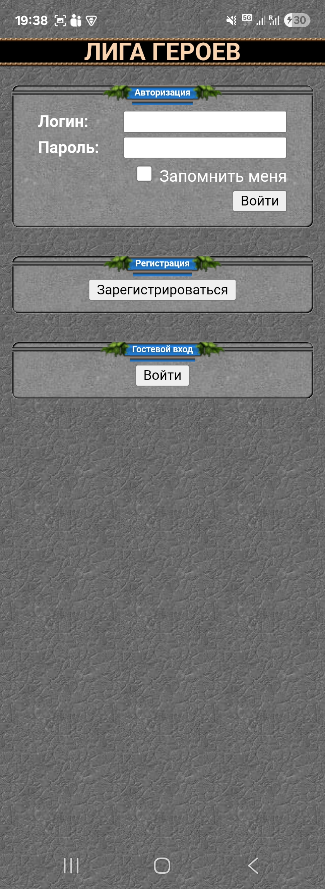 . 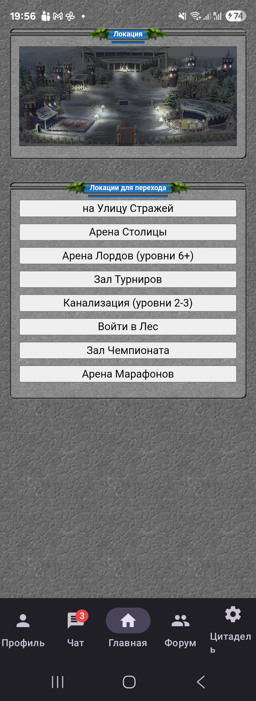 . 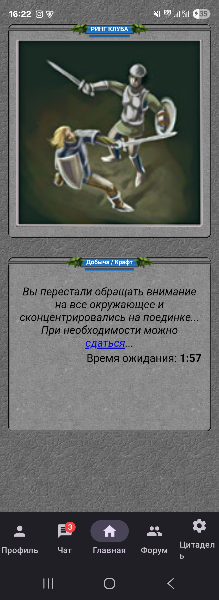 . 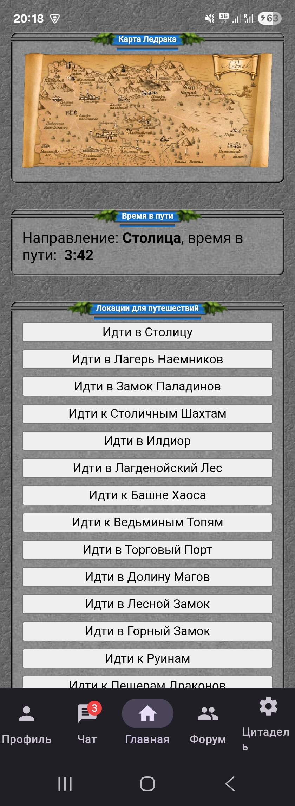
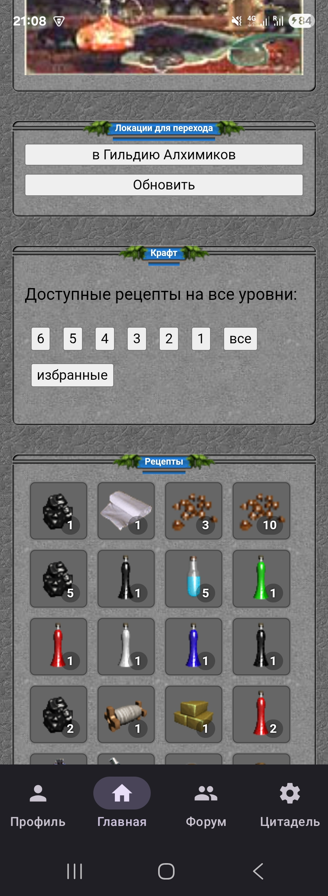 . 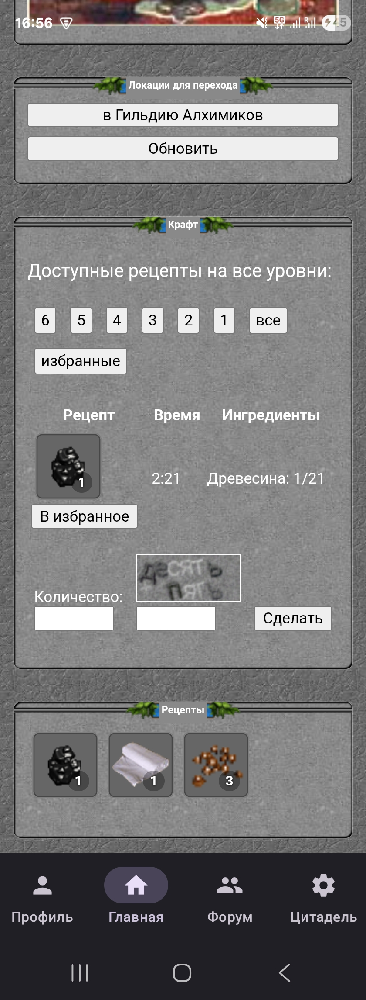 . 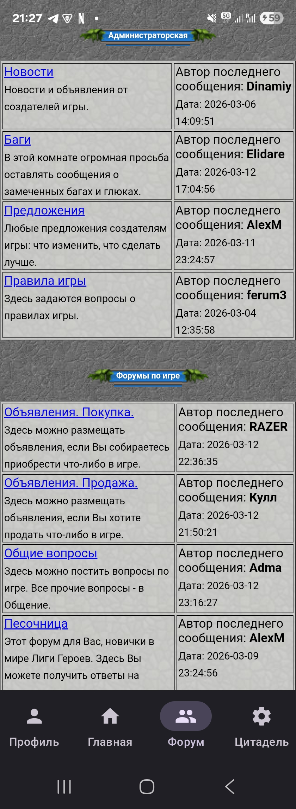 . 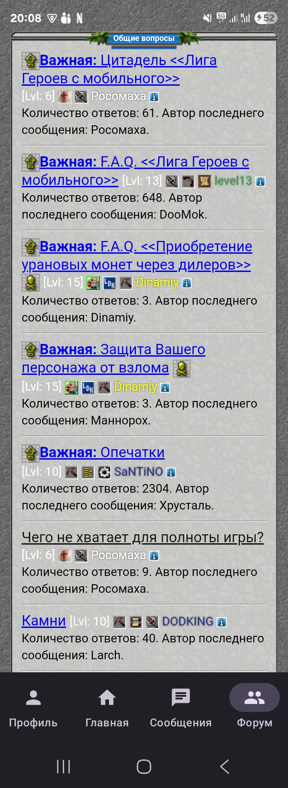
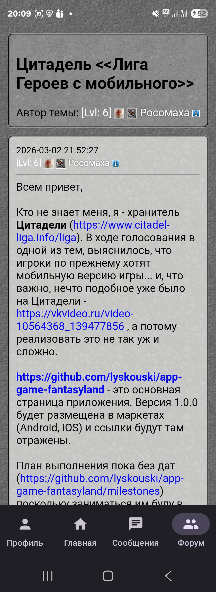 . 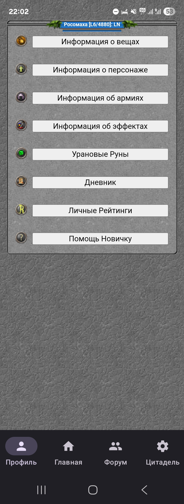 . 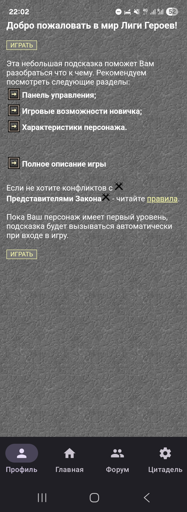 . 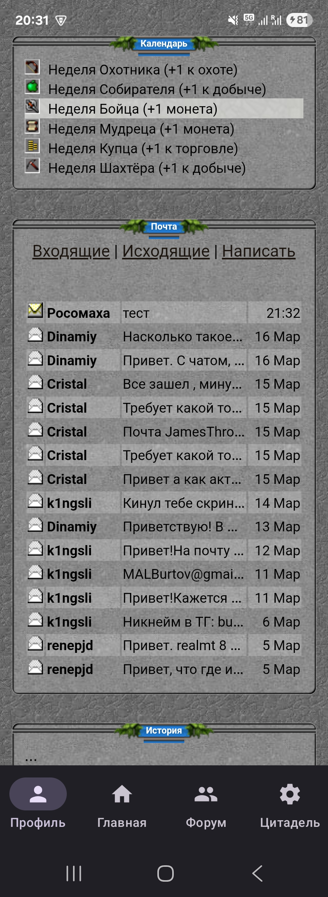
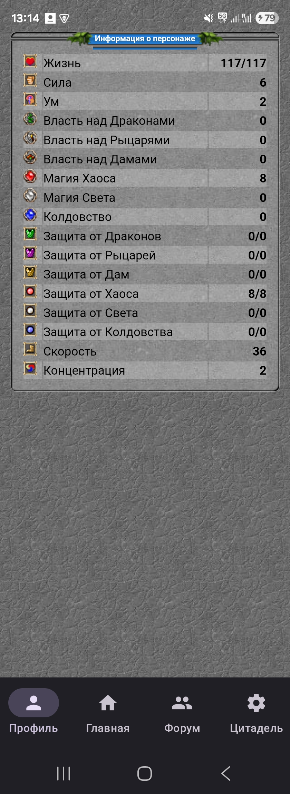 . 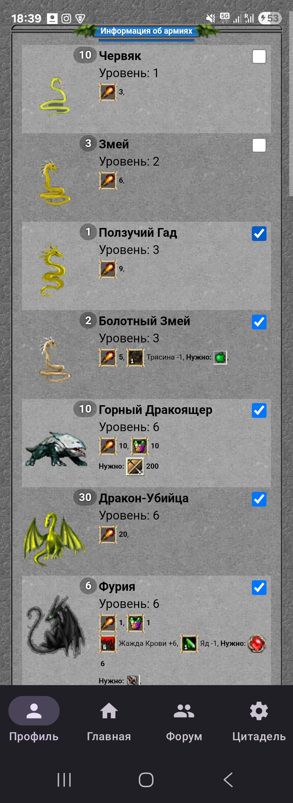 . 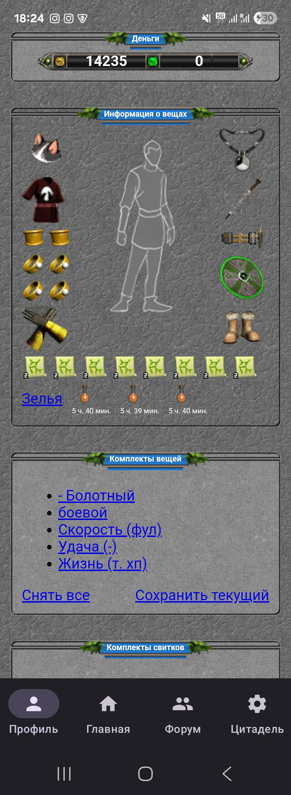 . 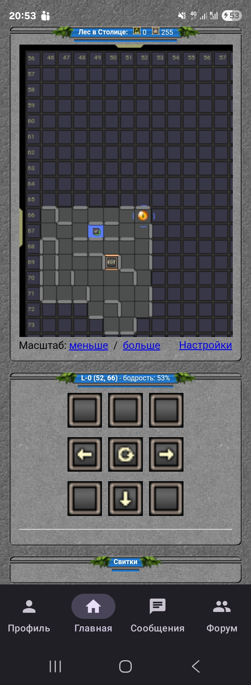
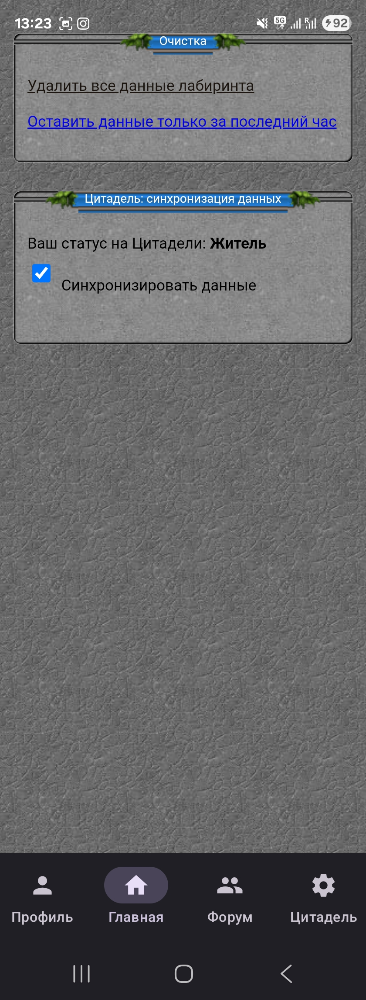 . 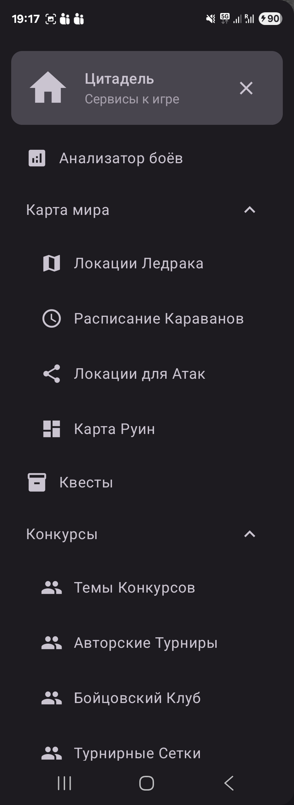 .  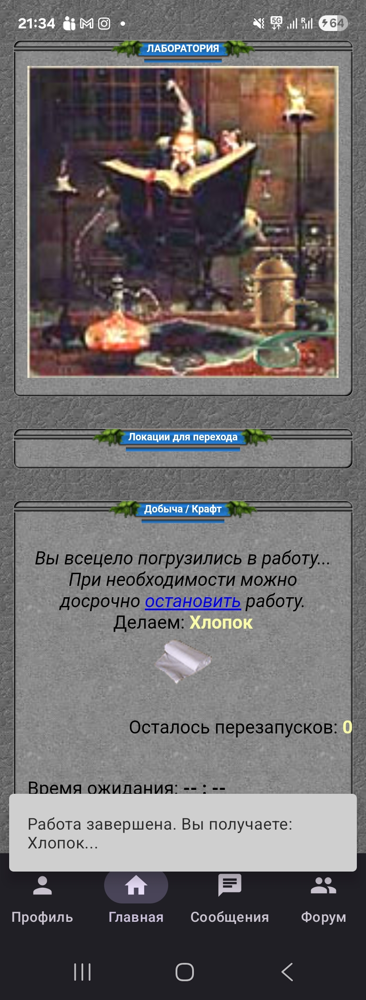 . 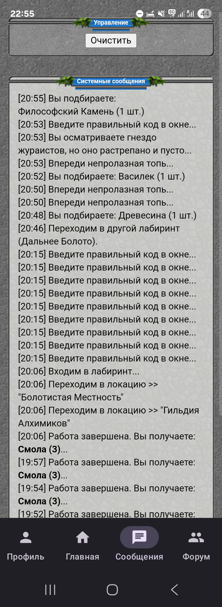
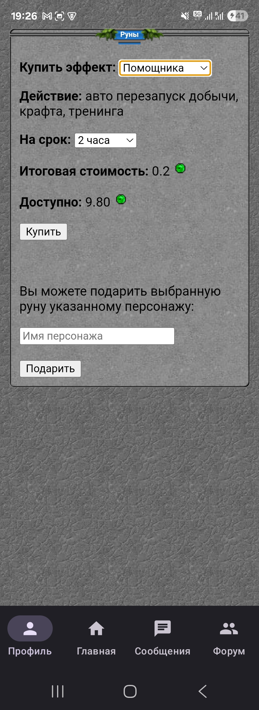 . 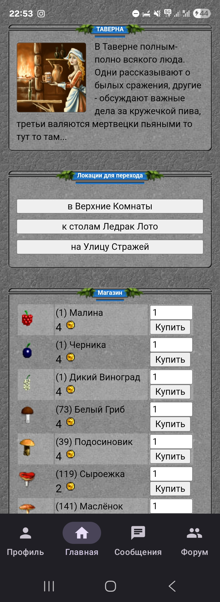 . 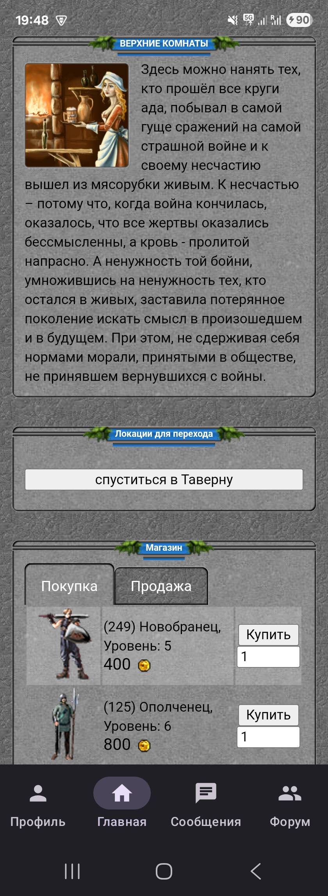 . 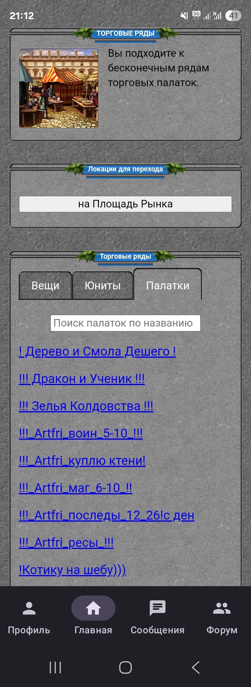
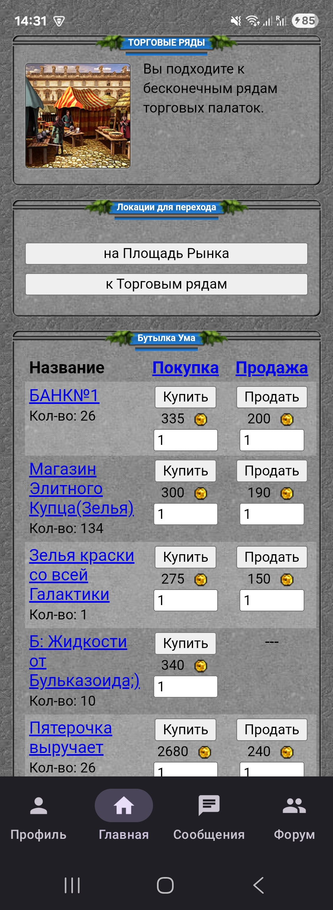 . 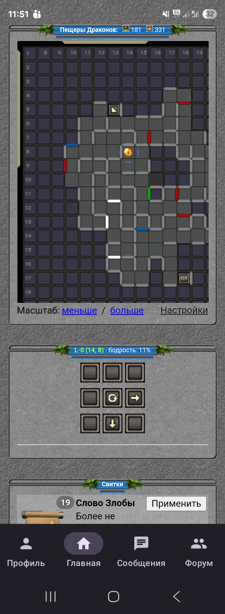 .

## Поддержка (Спонсорство)

Поскольку это проект с открытым исходным кодом, подписка не дает доступа к дополнительным функциям приложения. Однако
она станет вкладом в постоянное развитие и улучшение приложения. Если вы хотите поддержать нас финансово, рассмотрите
следующие варианты:

* [Github Sponsorship](https://github.com/users/lyskouski/sponsorship)
* [Paypal](https://www.paypal.me/terCAD)
* [Patreon](https://www.patreon.com/terCAD)
* [Donorbox](https://donorbox.org/tercad)

Или [купите чашечку кофе](https://www.buymeacoffee.com/lyskouski).

## Вклад

Любой вклад **очень ценится** (также, в знак благодарности, он будет упомянут в разделе «Участники», в примечаниях к
«Релизу» и в самом приложении). Более подробную информацию можно найти в разделе
[Contribution Section](./CONTRIBUTING.md).

Однако, если ваш вклад (не только исправление опечаток) в этот репозиторий был одобрен, вы соглашаетесь предоставить
мне неисключительную лицензию на использование этого контента по своему усмотрению (и усмотрению моей возможной
команды). Вы, вероятно, уже догадались об этом, но я просто хотел прояснить этот момент.

## Лицензия и авторские права

Всё содержание данного репозитория является собственностью &copy; 2026 **terCAD** Команды (Вячеслав Лысковский).

 Эта работа лицензирована в соответствии с <a rel="license" href="http://creativecommons.org/licenses/by-nc-nd/4.0/">лицензией Creative Commons Attribution-NonCommercial-NoDerivs 4.0 Unported License</a>:
- **Атрибуция**: предоставьте ссылку на лицензию и укажите, были ли внесены изменения
- **Некоммерческое использование**: не может быть использовано в составе коммерческого решения
- **Без производных работ**: любые модификации (ремиксы, преобразования или доработки материала) не могут распространяться самостоятельно.

Отправьте изменения обратно в основной репозиторий (https://github.com/lyskouski/app-game-fantasyland), чтобы
разблокировать распространение внесенных правок.
